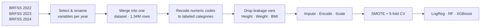

<div align="center">

# Predicting Obesity from Lifestyle & Health Factors
### A Machine Learning Study on CDC BRFSS Data (2022–2024)


*Can we tell whether someone has excess weight using only their demographics, habits, and health history, without measuring them?*

</div>

---

## 📌 Overview

This project uses **1.3 million survey responses** from the CDC's **Behavioral Risk Factor Surveillance System (BRFSS)** to build classification models that predict whether an adult is **overweight or obese**.

All body measurements (BMI, height, weight) are **deliberately excluded** from the final models. The goal is to see how much demographic, behavioral, and chronic-condition data can reveal about weight status by itself. This is the situation in a screening setting where body measurements aren't available.

| | |
|---|---|
| **Data source** | CDC BRFSS, survey years 2022, 2023, 2024 |
| **Respondents** | 1,336,125 (1,203,747 after removing missing outcomes) |
| **Target** | `Obese`: overweight or obese (BRFSS `_RFBMI5`, BMI > 25) |
| **Features** | 13 demographic, lifestyle, and health predictors |
| **Models** | Logistic Regression · Random Forest · XGBoost |
| **Best model** | **XGBoost**, ROC-AUC **0.670**, macro F1 **0.603** |

---

## 🔄 Project Pipeline



---

## 🧾 Features

| Category | Variables |
|---|---|
| **Demographic** | Age group, Sex, Education level, Income category |
| **Lifestyle** | Smoking status, Heavy drinking, Physical activity (past 30 days) |
| **Chronic conditions** | Diabetes, Asthma, Kidney disease, Arthritis, High cholesterol, High blood pressure |
| **Excluded (leakage)** | BMI, Height, Weight |

<details>
<summary><b>BRFSS variable mapping</b> (click to expand)</summary>

| Project name | BRFSS variable | Notes |
|---|---|---|
| `Age_group` | `_AGE_G` | 6 ordered groups (18–24 → 65+) |
| `Sex` | `SEXVAR` | |
| `Obese` *(target)* | `_RFBMI5` | Overweight or obese (BMI > 25) |
| `BMI` | `_BMI5` | Excluded from final models |
| `Height_in_m` | `HTM4` | Excluded |
| `Weight_in_kg` | `WTKG3` | Excluded |
| `Physical_Activity` | `_TOTINDA` | |
| `Smoker` | `_RFSMOK3` | |
| `Heavy_Drinker` | `_RFDRHV8` (2022–23), `_RFDRHV9` (2024) | |
| `Education_level` | `_EDUCAG` | 4 ordered levels |
| `Income_Cat` | `_INCOMG1` | 7 ordered brackets |
| `Diabetes` | `DIABETE4` | |
| `Asthma` | `ASTHNOW` | |
| `Kidney_Disease` | `CHCKDNY2` | |
| `Arthritis` | `_DRDXAR2` | |
| `High_Cholesterol` | `TOLDHI3` | 2023 only |
| `High_BP` | `BPMEDS1` | 2023 only |

</details>

---

## 🧪 Methodology

**1. Data preparation** (`BRFSS - Data Pre Processing.ipynb`)
- Loaded each survey year, selected the relevant variables, and gave them consistent names across years.
- Marked variables that weren't collected in a given year (cholesterol and blood pressure in 2022 and 2024) with the placeholder value `999`, then treated them as missing.
- Stacked the three years into a single dataset of **1,336,125 respondents**.

**2. Exploration & feature selection** (`Modelling.ipynb`)
- Converted BRFSS numeric codes into labeled, ordered categories. "Don't know" and "Refused" became missing.
- Found a strong correlation between **BMI and Weight (r = 0.85)**, so Height and Weight were dropped as redundant.
- Removed **BMI** as well, because it defines the target directly. Keeping it would cause **target leakage** and inflate performance.

**3. Preprocessing pipeline** (`scikit-learn ColumnTransformer`)

| Feature type | Imputation | Encoding |
|---|---|---|
| Ordinal (age, education, income) | Most frequent | `OrdinalEncoder` with explicit order |
| Binary (sex, habits, conditions) | Most frequent | `OrdinalEncoder` |
| Numeric (BMI, baseline only) | Mean | `StandardScaler` |

**4. Modeling**
- Stratified **80/20 train-test split**.
- **SMOTE** oversampling inside an `imblearn` pipeline to handle class imbalance (about 69% positive).
- **5-fold cross-validation** scored on macro F1, followed by evaluation on the held-out test set.

---

## 📊 Results

*Test set: 240,750 respondents. All models trained **without BMI, height, or weight**.*

| Model | CV Macro F1 | Accuracy | Macro F1 | Precision (Obese) | Recall (Obese) | ROC-AUC |
|---|:---:|:---:|:---:|:---:|:---:|:---:|
| Logistic Regression | 0.550 ± 0.001 | 0.56 | 0.55 | 0.78 | 0.50 | 0.627 |
| Random Forest | 0.597 ± 0.000 | 0.62 | 0.60 | 0.78 | 0.62 | 0.659 |
| **XGBoost** | **0.603 ± 0.000** | **0.62** | **0.60** | **0.78** | **0.62** | **0.670** |

### Key takeaways
- 🏆 **XGBoost performed best** on every metric, with tree-based models clearly ahead of the linear baseline.
- 🎯 Precision for the obese class is steady at **0.78** across models. When a model flags someone, it's right about 4 times out of 5.
- 📉 The modest ROC-AUC (~0.67) is a finding in itself. **Demographics, habits, and health history carry real but limited signal** about weight status, and body measurements stay essential for accurate classification.
- ✅ Cross-validation scores vary very little (std ≤ 0.001), so results are stable across folds.

---

## 📁 Repository Structure

```
BRFSS ML Project/
├── Dataset/
│   ├── BRFSS2022/        # Parquet splits for 2022
│   ├── BRFSS2023/        # Parquet splits for 2023
│   └── BRFSS2024/        # Parquet splits for 2024
├── Output/               # Generated .dta files (not tracked, too large)
├── Script/
│   ├── BRFSS - Data Pre Processing.ipynb
│   └── Modelling.ipynb
├── .gitignore
└── README.md
```

---

## 🚀 Getting Started

**1. Clone the repository**
```bash
git clone https://github.com/lulumassasi-coder/BRFSS.git
cd BRFSS
```

**2. Install dependencies**
```bash
pip install pandas numpy pyarrow pyreadstat scikit-learn imbalanced-learn xgboost matplotlib seaborn
```

**3. Get the data**

The original BRFSS `.XPT` files are about 1 GB per year, too large for GitHub. Download them from the [CDC BRFSS Annual Data page](https://www.cdc.gov/brfss/annual_data/annual_data.htm) and convert them to parquet, or use the parquet splits in `Dataset/`.

**4. Run the notebooks in order**
1. `Script/BRFSS - Data Pre Processing.ipynb` builds `Output/BRFSS_Merged.dta`
2. `Script/Modelling.ipynb` runs EDA, preprocessing, and model training

> ⚠️ Both notebooks start with `os.chdir(...)` pointing to a local Windows path. Change it to your own project folder before running.

---

## ⚠️ Limitations & Future Work

- **Partial-year variables.** High cholesterol and high blood pressure exist only in the 2023 survey, so most of their values are imputed.
- **Sparse asthma data.** `ASTHNOW` is asked only of respondents who have ever had asthma, so it's mostly missing.
- **Survey weights not applied.** BRFSS is a complex weighted survey, and these results describe the sample rather than the U.S. population.
- **Preprocessing order.** Imputation is fit before the train-test split. Moving it inside the cross-validation pipeline would tighten the evaluation.
- **Next steps.** Hyperparameter tuning, SHAP-based feature importance, decision-threshold tuning, and a separate model for clinical obesity (BMI ≥ 30, `_BMI5CAT`).

---

## 📚 Data Source

Centers for Disease Control and Prevention (CDC). *Behavioral Risk Factor Surveillance System Survey Data*, 2022–2024. Atlanta, Georgia: U.S. Department of Health and Human Services.

---

<div align="center">

**Lulu** · Syracuse University
[GitHub @lulumassasi-coder](https://github.com/lulumassasi-coder)

</div>
